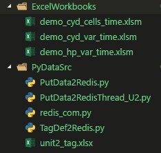

# 工业过程在线监视MS Excel工作簿

* [工业过程在线监视MsExcel工作簿实例:厂用电率在线监视(PDF版)](./doc/工业过程在线监视MsExcel工作簿实例.pdf)

## 1 软件环境

软件环境由：操作系统、办公软件、Python及其软件包、Redis数据库组成。

* 操作系统：Windows10 64位；

* 办公软件：Microsoft Excel2016 64位；

* Python及其软件包

    * Python：Python3.5 64位
　
    * Python Packages：

         * Pyredis:和redis交互数据API

         * Pywin32：Python extensions for Windows提供COM支持

         * Xlrd：读写Excel文件
　　　
* Redis：内存数据库，用于为Excel提供数据服务。

## 2 监视软件

可定制在线监视Excel工作簿标准模板示例:厂用电率在线监视

示例软件由2类文件组成,分别存放在各自的文件夹中：

* 1 运行数据仿真：PyDataSrc；

* 2 监视Excel工作簿: ExcelWorkbooks。



## 3 Building Running Environment

### 3.1 Install Redis for Windows

Redis官方不提供Windows版本,可使用微软技术开源组开发维护Windows版本Redis的msi安装包。

从：https://github.com/MSOpenTech/redis/releases  下载msi安装包，运行安装。    

### 3.2 Install Python Packages

* Pywin32(Python for Windows (pywin32) Extensions): 

```bash
>pip install pywin32
```
  then,for using pywin32 to register the COM objects,you must run:

```bash
>python Scripts/pywin32_postinstall.py -install
```
  
* Xlrd

```bash  
>pip install xlrd
```
* Pyredis

```bash    
>pip install redis    
```

## 4 Running Demo 

示例系统运行的3个步骤：

### 4.1 初始化运行数据服务
   
#### 4.1.1 注册Redis数据交互COM组件(只需注册一次)

```bash
>python redis_com.py
```

#### 4.1.2 在Redis中建立点表(Redis默认安装提供数据持久化，只需运行一次)

```bash
>python TagDef2Redis.py
```

### 4.2 运行数据仿真
   
发送运行数据到Redis: 

```bash 
>python PutData2RedisThread_U2.py
```

从unit2_tag.xlsx提取运行数据，发送到Redis，仿真运行数据

### 4.3 在线监视

启动在线监视工作簿：demo_cyd_cells_time.xlsm / demo_cyd_var_time.xlsm

