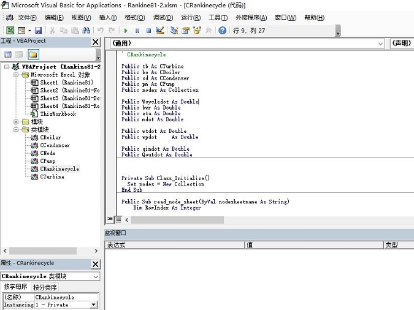

# The Examples of Excel VBA for Engineering

**VBA** stands for Visual Basic for Applications. It's a programming language that enables you to control just about everything in Excel. 

Learning **Excel VBA** will enable you to do a lot more with the software than you can via the normal spreadsheet view.

For Engineer: **Excel VBA is A Sharp Programming Tool at Hands** 

## 1 [Analysizing the Ideal Rankine Cycle](./VBARankine)

## 2 [Monitoring Industrial Procss](./MonitoringWithExcel)

## [The Programming Guide of Excel VBA](./ExcelVBA.md)

